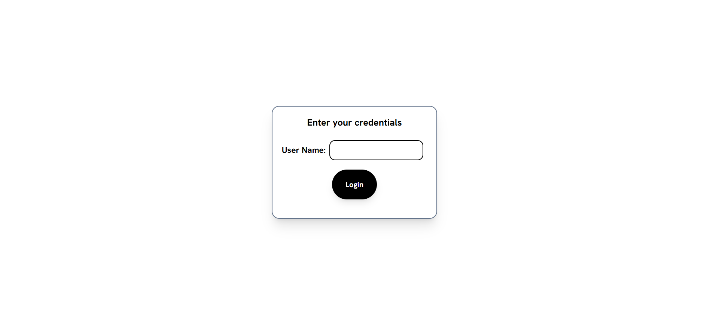
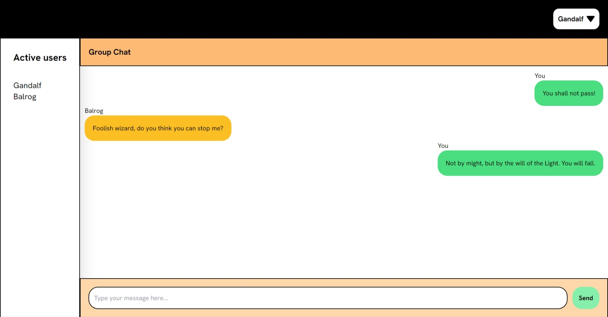
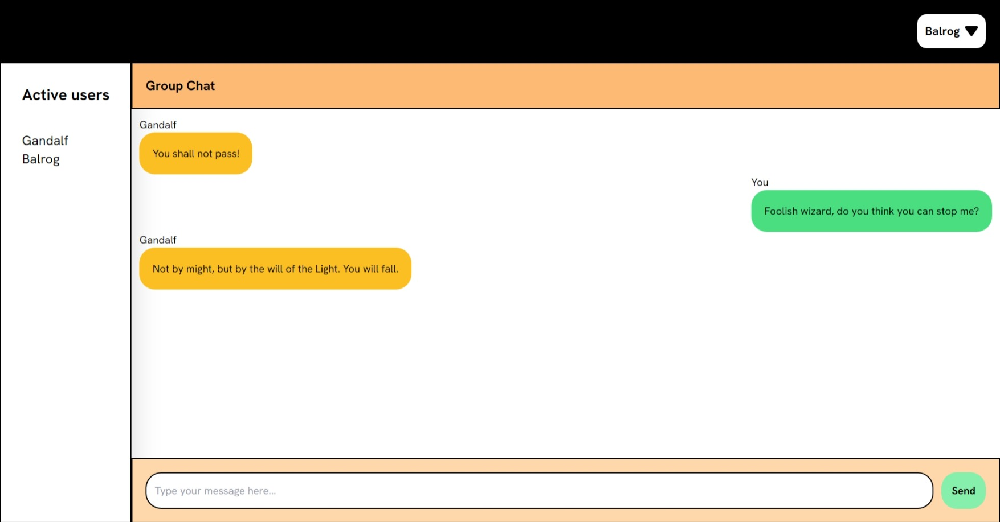

# About the project

This is a chatapp that enables realtime communiccation.

## Technologies used

- SocketIO⚡️
- Zustand *️⃣
- ReactJS ⚛️
- Tailwind CSS 🎨
- NodeJS 💻
- ExpressJS 💻

## Live demo

[Live demo link](https://realtime-chatapp-frontend.netlify.app/)

## Link to backend code

[Frontend code](https://github.com/Pradikshan/chatapp-frontend)

## Screenshots of the project

### Login Page

### Chat Page

